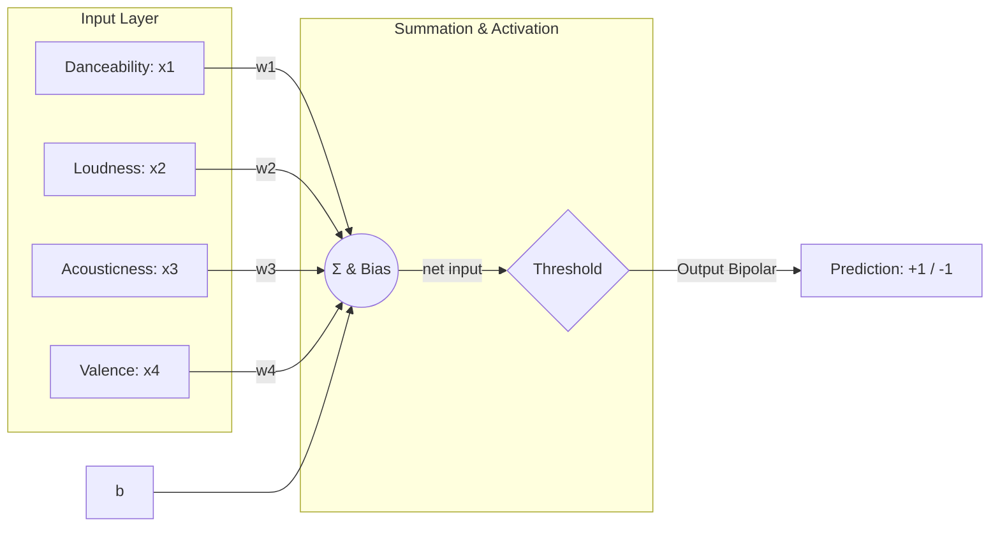
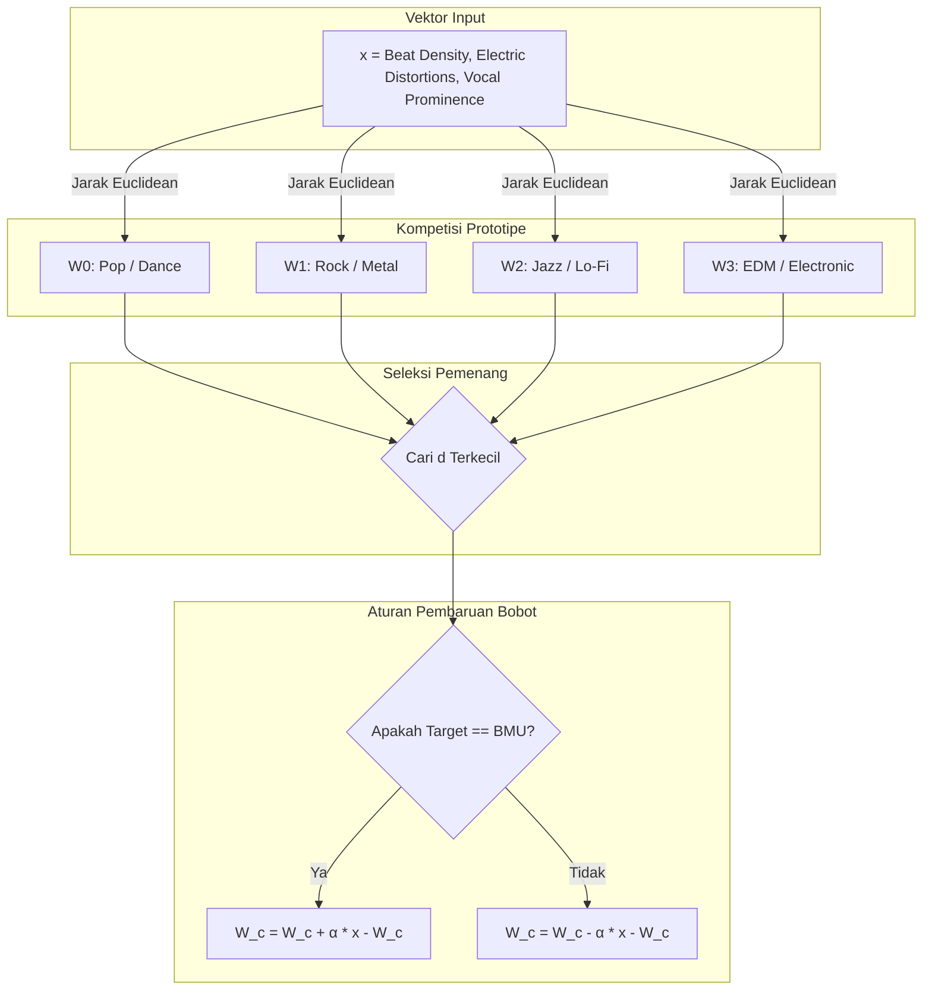

#  LAPORAN TUGAS AKHIR / UJIAN AKHIR SEMESTER (UAS)
# JARINGAN SARAF TIRUAN (JST)

##  SoundSync: Music Vibe & Genre Classifier
> **Aplikasi Asisten Deteksi Genre & Karakteristik Suara Musik Berbasis Jaringan Saraf Tiruan (Adaline & LVQ) yang Dibangun Secara Mandiri (From Scratch)**

---

###  Identitas Mahasiswa
* **Nama Lengkap:** Muhammad Abday Abdul Hafidz
* **NIM:** 1123150093
* **Kelas:** TI-23-SE-1
* **Program Studi:** Teknik Informatika (Software Engineering)
* **Dosen Pengampu:** Vicky Indrawan, S.T., M.Sc.
* **Mata Kuliah:** Jaringan Saraf Tiruan (JST)

---

##  DAFTAR ISI
1. [Latar Belakang & Deskripsi Kasus](#-bab-i-latar-belakang--deskripsi-kasus)
2. [Landasan Teori & Arsitektur JST](#-bab-ii-landasan-teori--arsitektur-jst)
3. [Metodologi & Contoh Perhitungan Manual](#-bab-iii-metodologi--contoh-perhitungan-manual)
4. [Implementasi Sistem & Hasil Analisis Parameter](#-bab-iv-implementasi-sistem--hasil-analisis-parameter)
5. [Panduan Penggunaan (Instalasi & Eksekusi)](#-bab-v-panduan-penggunaan-instalasi--eksekusi)
6. [Kesimpulan & Saran](#-bab-vi-kesimpulan--saran)

---

##  BAB I: LATAR BELAKANG & DESKRIPSI KASUS

### 1.1 Latar Belakang Masalah
Dalam industri musik modern dan rekayasa perangkat lunak audio, pengenalan karakteristik dan genre lagu secara otomatis merupakan komponen penting bagi sistem rekomendasi (*music recommendation engines*). Mengklasifikasikan lagu secara manual membutuhkan waktu yang sangat lama dan bersifat subjektif. Oleh karena itu, diperlukan pendekatan otomatisasi menggunakan kecerdasan buatan untuk menganalisis parameter audio secara objektif.

Proyek **SoundSync** dirancang untuk menjawab kebutuhan ini dengan mengombinasikan dua metode Jaringan Saraf Tiruan (JST) untuk analisis lagu:
1. **Prediksi Karakteristik Vibe (Model Adaline):** Memprediksi apakah suatu lagu memiliki getaran berenergi/cepat (**Energetic & Upbeat**) atau getaran lambat/lembut (**Calm & Relaxing**) berdasarkan tempo, kenyaringan, akustik, dan valensi emosional.
2. **Klasifikasi Genre Musik (Model LVQ):** Mengklasifikasikan lagu ke dalam 4 genre utama (**Pop / Dance, Rock / Metal, Jazz / Lo-Fi, atau EDM / Electronic**) berdasarkan densitas beat, distorsi elektrik, dan kemenonjolan vokal.

---

## ️ BAB II: LANDASAN TEORI & ARSITEKTUR JST

### 2.1 Model 1: Adaline (Adaptive Linear Neuron)
Adaline adalah jaringan saraf lapis tunggal yang menggunakan fungsi aktivasi linear selama pelatihan dan menerapkan fungsi ambang batas bipolar hanya pada penarikan kesimpulan klasifikasi akhir. Pelatihan Adaline didasarkan pada **Aturan Delta (Delta Rule)** untuk meminimalkan Mean Squared Error (MSE).

#### Arsitektur Adaline
* **Input Layer ($X$):** Terdiri dari 4 fitur audio teknis:
  - $x_1$: Tempo / Danceability (skala $0.1 - 1.0$)
  - $x_2$: Kenyaringan / Volume Loudness (normalisasi desibel $-60$ s/d $0$)
  - $x_3$: Acousticness (kemurnian instrumen akustik, skala $0.0 - 1.0$)
  - $x_4$: Valence (keceriaan lirik/emosi lagu, skala $0.0 - 1.0$)
* **Bobot ($W$) & Bias ($b$):** Masing-masing input memiliki bobot $w_i$ dan satu bias $b$.
* **Fungsi Aktivasi Latihan:** Aktivasi linear di mana output bersih ($net$) diumpankan langsung ke fungsi error.
  $$net = \sum_{i=1}^{4} (x_i \cdot w_i) + b$$
* **Fungsi Klasifikasi Prediksi (Bipolar):**
  $$f(net) = \begin{cases} +1, & \text{jika } net \geq 0 \text{ (Energetic & Upbeat)} \\ -1, & \text{jika } net < 0 \text{ (Calm & Relaxing)} \end{cases}$$



---

### 2.2 Model 2: Learning Vector Quantization (LVQ)
LVQ adalah metode pembelajaran kompetitif terawasi untuk melakukan klasifikasi multi-kelas menggunakan beberapa vektor representatif (prototipe).

#### Arsitektur LVQ
* **Input Layer ($X$):** Terdiri dari 3 fitur representatif audio:
  - $x_1$: Kerapatan Ketukan / Beat Density ($0.0 - 1.0$)
  - $x_2$: Distorsi Elektrik / Synth Distortions ($0.0 - 1.0$)
  - $x_3$: Kemenonjolan Vokal / Vocal Prominence ($0.0 - 1.0$)
* **Output Layer (Prototipe / Kodebook):** Terdiri dari 4 kelas genre musik:
  - **Kelas 0:** *Pop / Dance* (Prototipe $W_0$)
  - **Kelas 1:** *Rock / Metal* (Prototipe $W_1$)
  - **Kelas 2:** *Jazz / Lo-Fi* (Prototipe $W_2$)
  - **Kelas 3:** *EDM / Electronic* (Prototipe $W_3$)

#### Algoritma Pembaruan Bobot LVQ
1. Hitung Jarak Euclidean dari vektor input $x$ ke setiap vektor prototipe $W_j$:
   $$d(x, W_j) = \sqrt{\sum_{i=1}^{n} (x_i - w_{ji})^2}$$
2. Cari prototipe terdekat (BMU) dengan indeks $c$ yang memiliki jarak terkecil:
   $$d(x, W_c) = \min_{j} d(x, W_j)$$
3. Perbarui vektor prototipe pemenang $W_c$:
   - Jika kelas prototipe $W_c$ **sama** dengan kelas target dari data input $y$ ($T_c == y$):
     $$W_c^{(baru)} = W_c^{(lama)} + \alpha \cdot (x - W_c^{(lama)})$$
   - Jika kelas prototipe $W_c$ **tidak sama** dengan kelas target dari data input $y$ ($T_c \neq y$):
     $$W_c^{(baru)} = W_c^{(lama)} - \alpha \cdot (x - W_c^{(lama)})$$



---

##  BAB III: METODOLOGI & CONTOH PERHITUNGAN MANUAL

### 3.1 Dataset & Normalisasi
Model dilatih menggunakan dataset sintetis karakteristik akustik lagu:
* **Adaline:** $180$ sampel data karakteristik teknis lagu. Normalisasi Min-Max dilakukan pada fitur kenyaringan (loudness) dari range $[-60, 0]$ dB ke skala $[0, 1]$.
* **LVQ:** $160$ sampel data representatif lagu yang terbagi merata ke dalam 4 kategori genre utama.

| Model | Fitur Input | Tipe Data Asli | Rumus Normalisasi | Range Target |
|---|---|---|---|---|
| **Adaline** | Tempo/Danceability | Nilai $0.1 - 1.0$ | $x_{1,norm} = x_1$ | $[0.1, 1.0]$ |
| | Kenyaringan | dB ($-60.0 - 0.0$) | $x_{2,norm} = \frac{x_2 + 60.0}{60.0}$ | $[0.0, 1.0]$ |
| | Acousticness | Skala $0.0 - 1.0$ | $x_{3,norm} = x_3$ | $[0.0, 1.0]$ |
| | Valence | Skala $0.0 - 1.0$ | $x_{4,norm} = x_4$ | $[0.0, 1.0]$ |
| **LVQ** | Beat, Distorsi, Vokal | Skala $0.0 - 1.0$ | Tidak perlu | $[0.0, 1.0]$ |

---

### 3.2 Perhitungan Manual Satu Iterasi Adaline
#### 1. Parameter Awal
* **Vektor Input ($X$):** $[0.8, 0.4, 0.2, 0.9]$ (Tempo, Loudness, Acousticness, Valence)
* **Target Bipolar ($y$):** $+1$ (Energetic / Upbeat)
* **Vektor Bobot Awal ($W$):** $[0.1, -0.2, 0.15, 0.3]^T$
* **Bias Awal ($b$):** $0.05$
* **Laju Pembelajaran ($\eta$):** $0.1$

#### 2. Langkah Perambatan Maju (Forward Pass)
Menghitung masukan bersih ($net$):
$$net = \sum_{i=1}^{4} (x_i \cdot w_i) + b$$
$$net = (0.8 \cdot 0.1) + (0.4 \cdot -0.2) + (0.2 \cdot 0.15) + (0.9 \cdot 0.3) + 0.05$$
$$net = 0.08 - 0.08 + 0.03 + 0.27 + 0.05 = 0.35$$

#### 3. Kalkulasi Nilai Error ($E$)
$$E = y - net$$
$$E = 1 - 0.35 = 0.65$$

#### 4. Pembaruan Bobot dan Bias (Delta Rule)
* **Pembaruan Bobot ($\Delta w_i = \eta \cdot E \cdot x_i$):**
  - $w_1^{(baru)} = 0.1 + (0.1 \cdot 0.65 \cdot 0.8) = 0.152$
  - $w_2^{(baru)} = -0.2 + (0.1 \cdot 0.65 \cdot 0.4) = -0.174$
  - $w_3^{(baru)} = 0.15 + (0.1 \cdot 0.65 \cdot 0.2) = 0.163$
  - $w_4^{(baru)} = 0.3 + (0.1 \cdot 0.65 \cdot 0.9) = 0.3585$
* **Pembaruan Bias:**
  - $b^{(baru)} = 0.05 + (0.1 \cdot 0.65) = 0.115$

---

### 3.3 Perhitungan Manual Satu Iterasi LVQ
#### 1. Parameter Awal
* **Vektor Input ($x$):** $[0.7, 0.3, 0.8]$ (Beat, Distorsi, Vokal) dengan target kelas $y = 0$ (Pop / Dance)
* **Vektor Prototipe Kelas ($W_j$):**
  - Kelas 0 ($W_0$): $[0.6, 0.2, 0.7]$
  - Kelas 1 ($W_1$): $[0.3, 0.8, 0.4]$
  - Kelas 2 ($W_2$): $[0.5, 0.4, 0.9]$
  - Kelas 3 ($W_3$): $[0.1, 0.1, 0.2]$
* **Learning Rate ($\alpha$):** $0.5$

#### 2. Hitung Jarak Euclidean ke Seluruh Prototipe
* **Jarak ke Kelas 0 ($W_0$):**
  $$d(x, W_0) = \sqrt{(0.7-0.6)^2 + (0.3-0.2)^2 + (0.8-0.7)^2} = \sqrt{0.03} \approx 0.1732$$
* **Jarak ke Kelas 1 ($W_1$):**
  $$d(x, W_1) = \sqrt{(0.7-0.3)^2 + (0.3-0.8)^2 + (0.8-0.4)^2} = \sqrt{0.57} \approx 0.7550$$
* **Jarak ke Kelas 2 ($W_2$):**
  $$d(x, W_2) = \sqrt{(0.7-0.5)^2 + (0.3-0.4)^2 + (0.8-0.9)^2} = \sqrt{0.06} \approx 0.2449$$
* **Jarak ke Kelas 3 ($W_3$):**
  $$d(x, W_3) = \sqrt{(0.7-0.1)^2 + (0.3-0.1)^2 + (0.8-0.2)^2} = \sqrt{0.76} \approx 0.8718$$

*BMU adalah $W_0$ karena jaraknya paling kecil ($0.1732$).*

#### 3. Pembaruan Bobot Prototipe Pemenang
Karena kelas prototipe pemenang (Pop / Dance) sama dengan target input ($y = 0$), maka:
$$W_0^{(baru)} = W_0 + \alpha \cdot (x - W_0)$$
$$W_0^{(baru)} = [0.6, 0.2, 0.7] + 0.5 \cdot ([0.7, 0.3, 0.8] - [0.6, 0.2, 0.7]) = [0.65, 0.25, 0.75]$$

---

##  BAB IV: IMPLEMENTASI SISTEM & HASIL ANALISIS PARAMETER

### 4.1 Deskripsi Fitur Dashboard Utama
* **Interactive Sidebar:** Menyediakan slider parameter teknis dan akustik lagu secara dinamis.
* **Dashboard Hasil Klasifikasi:** Menampilkan persentase kecenderungan energi lagu (Adaline) dan kluster genre lagu yang dideteksi (LVQ).
* **Contoh Lagu Serupa:** Memberikan rekomendasi lagu-lagu legendaris yang memiliki koordinat kluster JST serupa dengan parameter input secara dinamis.

---

### 4.2 Analisis Pengaruh Learning Rate ($\eta$)
Model Adaline dilatih dengan tiga variasi nilai $\eta$ untuk menganalisis konvergensi MSE:
* **$\eta = 0.01$ (Terlalu Kecil):** Konvergensi sangat lambat dan memerlukan jumlah epoch yang besar untuk meminimalkan error.
* **$\eta = 0.1$ (Optimal):** Kurva MSE menurun dengan mulus dan mencapai konvergensi minimum yang stabil dengan cepat.
* **$\eta = 0.5$ (Terlalu Besar):** Model berosilasi secara ekstrem karena langkah pembaruan melompati batas minimum lokal, menyebabkan ketidakstabilan pelatihan.

---

### 4.3 Visualisasi Batas Keputusan (Decision Boundary) & Ruang 3D
* **Decision Boundary 2D (Adaline):** Memproyeksikan data training Tempo/Danceability ($x_1$) vs Acousticness ($x_3$) untuk menunjukkan batas klasifikasi linear dinamis.
* **Kluster 3D Prototipe (LVQ):** Memplot koordinat tiga parameter input ke dalam ruang 3 dimensi untuk memvisualisasikan posisi 4 prototipe genre musik (Pop, Rock, Jazz, EDM) dan parameter lagu Anda saat ini secara real-time.

---

##  BAB V: PANDUAN PENGGUNAAN (INSTALASI & EKSEKUSI)

### 5.1 Prasyarat Sistem
* Python versi 3.8 ke atas terinstal di komputer.

### 5.2 Cara Menjalankan
Arahkan terminal ke folder proyek:
```bash
cd C:\Users\LENOVO\uas_jst
```
Aktifkan virtual environment:
* **PowerShell:** `.\venv\Scripts\Activate.ps1`
* **CMD:** `.\venv\Scripts\activate.bat`

Instal pustaka pendukung:
```bash
pip install -r requirements.txt
```
Jalankan server aplikasi Streamlit:
```bash
streamlit run app.py
```
Aplikasi akan otomatis terbuka pada alamat web: **`http://localhost:8501`**

---

##  BAB VI: KESIMPULAN & SARAN

### 6.1 Kesimpulan
1. Model **Adaline** berhasil mengklasifikasikan karakteristik vibe musik (*Energetic* vs *Calm*) secara linear dengan menghitung kombinasi tertimbang dari tempo, volume, kemurnian akustik, dan valensi.
2. Model **LVQ** berhasil diimplementasikan untuk mengelompokkan karakteristik akustik musik ke dalam 4 genre (*Pop/Dance, Rock/Metal, Jazz/Lo-Fi, dan EDM*) menggunakan jarak Euclidean terdekat.
3. Kestabilan pelatihan model sangat dipengaruhi oleh parameter *learning rate* di mana $\eta = 0.1$ terbukti paling optimal.

---
*Laporan UAS Jaringan Saraf Tiruan ini disusun oleh Muhammad Abday Abdul Hafidz (1123150093).*