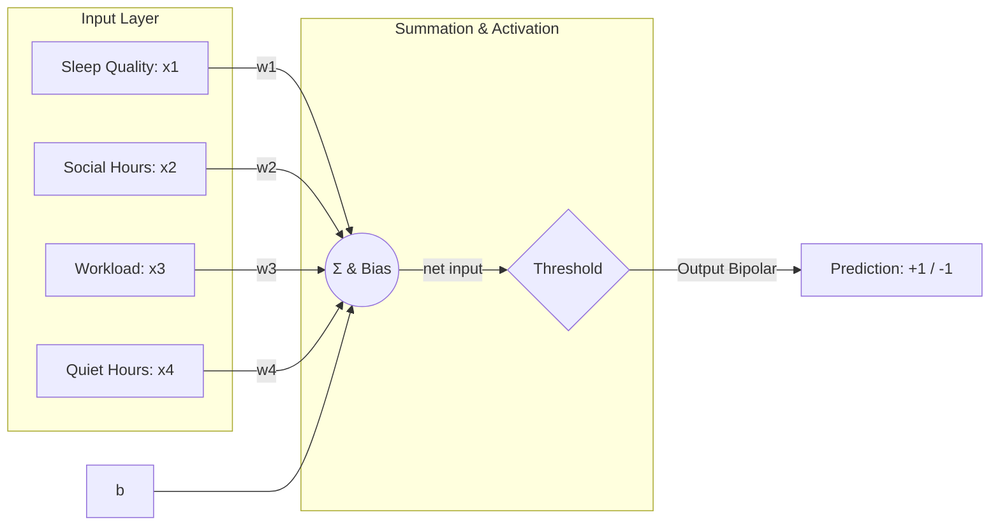
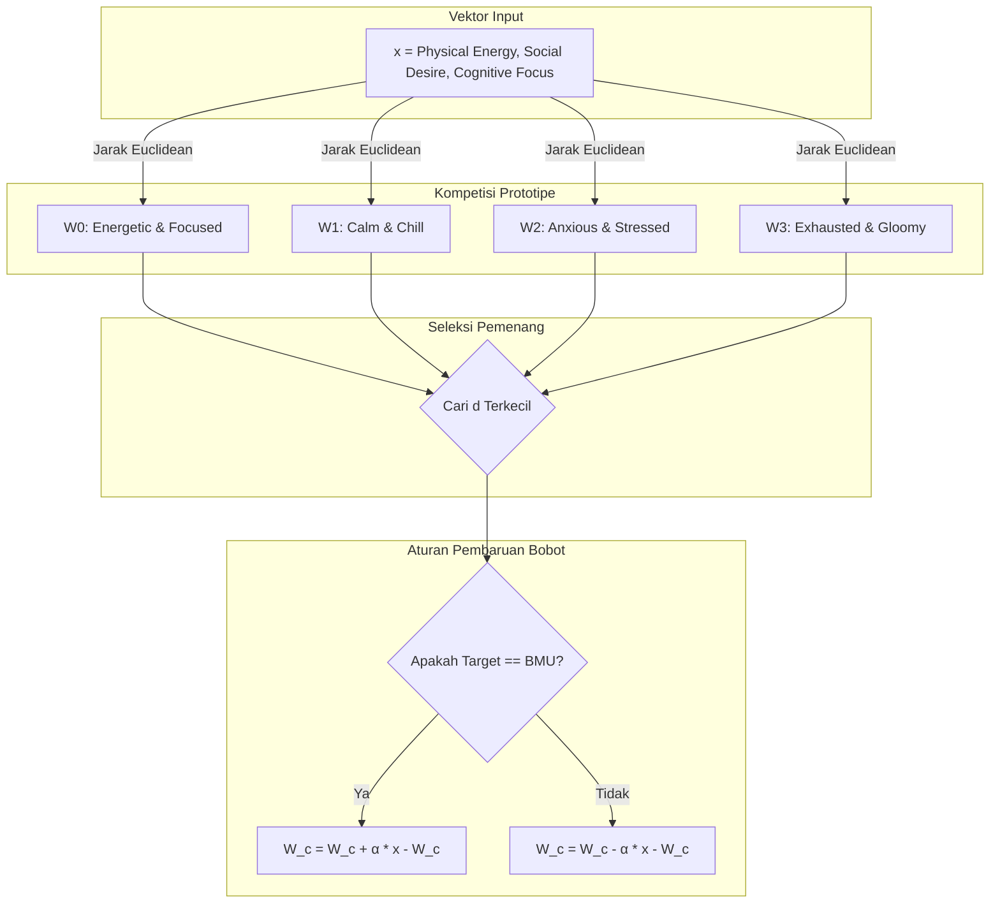

# 📚 LAPORAN TUGAS AKHIR / UJIAN AKHIR SEMESTER (UAS)
# JARINGAN SARAF TIRUAN (JST)

## 🌟 VibeSync: Social Battery & Mood Optimizer
> **Aplikasi Asisten Kesehatan Mental & Produktivitas Berbasis Jaringan Saraf Tiruan (Adaline & LVQ) yang Dibangun Secara Mandiri (From Scratch)**

---

### 👤 Identitas Mahasiswa
* **Nama Lengkap:** Muhammad Abday Abdul Hafidz
* **NIM:** 1123150093
* **Kelas:** TI-23-SE-1
* **Program Studi:** Teknik Informatika (Software Engineering)
* **Dosen Pengampu:** Tim Dosen Jaringan Saraf Tiruan
* **Mata Kuliah:** Jaringan Saraf Tiruan (JST)

---

## 📖 DAFTAR ISI
1. [Latar Belakang & Deskripsi Kasus](#-bab-i-latar-belakang--deskripsi-kasus)
2. [Landasan Teori & Arsitektur JST](#-bab-ii-landasan-teori--arsitektur-jst)
3. [Metodologi & Contoh Perhitungan Manual](#-bab-iii-metodologi--contoh-perhitungan-manual)
4. [Implementasi Sistem & Hasil Analisis Parameter](#-bab-iv-implementasi-sistem--hasil-analisis-parameter)
5. [Panduan Penggunaan (Instalasi & Eksekusi)](#-bab-v-panduan-penggunaan-instalasi--eksekusi)
6. [Kesimpulan & Saran](#-bab-vi-kesimpulan--saran)

---

## 📂 BAB I: LATAR BELAKANG & DESKRIPSI KASUS

### 1.1 Latar Belakang Masalah
Dalam kehidupan modern, khususnya di kalangan mahasiswa dan pekerja teknologi informasi, manajemen kapasitas sosial (*social battery*) dan kesadaran akan kondisi emosional (*mood*) sering kali terabaikan. Beban kerja akademis yang tinggi, ditambah interaksi sosial yang intensif, sering kali memicu kejenuhan mental (*burnout*) tanpa disadari secara dini. 

Untuk mengatasi tantangan ini, diperlukan sebuah sistem cerdas yang mampu mengukur kapasitas energi sosial harian dan mengklasifikasikan suasana hati pengguna. Proyek **VibeSync** dirancang untuk menjawab kebutuhan tersebut dengan menggabungkan konsep psikologi harian dengan algoritma Jaringan Saraf Tiruan (JST).

### 1.2 Deskripsi Sistem
**VibeSync** adalah aplikasi asisten cerdas berbasis web yang memetakan aktivitas harian dan indikator fisik-mental ke dalam prediksi status sosial dan suasana hati. Sistem ini mengintegrasikan dua model JST yang dibangun sepenuhnya dari nol (*from scratch*) menggunakan pustaka **NumPy**:
1. **Prediksi Social Battery (Model Adaline):** Memprediksi apakah pengguna berada dalam kondisi prima (**Energized**) atau lelah secara sosial (**Drained**) berdasarkan parameter aktivitas terukur (kualitas tidur, durasi sosialisasi, beban kerja, dan durasi *me-time*).
2. **Klasifikasi Mood Vibe (Model LVQ):** Mengklasifikasikan kondisi psikologis pengguna ke dalam 4 tipe suasana hati (*Energetic & Focused, Calm & Chill, Anxious & Stressed, atau Exhausted & Gloomy*) berdasarkan indikator internal (energi fisik, hasrat sosial, dan fokus mental).

---

## 🛠️ BAB II: LANDASAN TEORI & ARSITEKTUR JST

### 2.1 Model 1: Adaline (Adaptive Linear Neuron)
Adaline adalah salah satu bentuk awal jaringan saraf lapis tunggal (*single-layer neural network*). Perbedaan utama Adaline dengan Perceptron biasa terletak pada proses pembelajarannya; Adaline menggunakan fungsi aktivasi linear untuk melatih bobotnya dan hanya menerapkan fungsi ambang batas (*threshold*) saat melakukan klasifikasi akhir. Algoritma pelatihannya didasarkan pada **Aturan Delta (Delta Rule)** atau aturan kuadrat terkecil (*Least Mean Squares* / LMS).

#### Arsitektur Adaline
* **Input Layer ($X$):** Terdiri dari 4 fitur ternormalisasi:
  - $x_1$: Kualitas Tidur (skala $0.1 - 1.0$)
  - $x_2$: Durasi Bersosialisasi (jam, normalisasi $0 - 10$)
  - $x_3$: Jumlah Tugas/Beban Kerja (normalisasi $1 - 12$)
  - $x_4$: Durasi Me-Time / Quiet Hours (jam, normalisasi $0 - 8$)
* **Bobot ($W$) & Bias ($b$):** Masing-masing input memiliki bobot $w_i$ dan satu bias $b$.
* **Fungsi Aktivasi Latihan:** Aktivasi linear di mana output bersih ($net$) diumpankan langsung ke fungsi error.
  $$net = \sum_{i=1}^{4} (x_i \cdot w_i) + b$$
* **Fungsi Klasifikasi Prediksi (Bipolar):**
  $$f(net) = \begin{cases} +1, & \text{jika } net \geq 0 \text{ (Energized)} \\ -1, & \text{jika } net < 0 \text{ (Drained)} \end{cases}$$



---

### 2.2 Model 2: Learning Vector Quantization (LVQ)
LVQ adalah metode pembelajaran kompetitif terawasi (*supervised competitive learning*). Jaringan ini membagi ruang input ke dalam beberapa kelas representatif yang diwakili oleh vektor-vektor prototipe (*codebook vectors*). 

#### Arsitektur LVQ
* **Input Layer ($X$):** Terdiri dari 3 fitur representatif:
  - $x_1$: Energi Fisik ($0.0 - 1.0$)
  - $x_2$: Hasrat Bersosialisasi ($0.0 - 1.0$)
  - $x_3$: Fokus Mental ($0.0 - 1.0$)
* **Output Layer (Prototipe / Kodebook):** Terdiri dari 4 kelas suasana hati:
  - **Kelas 0:** *Energetic & Focused* (Prototipe $W_0$)
  - **Kelas 1:** *Calm & Chill* (Prototipe $W_1$)
  - **Kelas 2:** *Anxious & Stressed* (Prototipe $W_2$)
  - **Kelas 3:** *Exhausted & Gloomy* (Prototipe $W_3$)

#### Algoritma Pembaruan Bobot LVQ
1. Hitung Jarak Euclidean dari vektor input $x$ ke setiap vektor prototipe $W_j$:
   $$d(x, W_j) = \sqrt{\sum_{i=1}^{n} (x_i - w_{ji})^2}$$
2. Cari prototipe terdekat (pemenang / *Best Matching Unit* - BMU) dengan indeks $c$ yang memiliki jarak terkecil:
   $$d(x, W_c) = \min_{j} d(x, W_j)$$
3. Perbarui vektor prototipe pemenang $W_c$:
   - Jika kelas prototipe $W_c$ **sama** dengan kelas target dari data input $y$ ($T_c == y$):
     $$W_c^{(baru)} = W_c^{(lama)} + \alpha \cdot (x - W_c^{(lama)})$$
   - Jika kelas prototipe $W_c$ **tidak sama** dengan kelas target dari data input $y$ ($T_c \neq y$):
     $$W_c^{(baru)} = W_c^{(lama)} - \alpha \cdot (x - W_c^{(lama)})$$
   *(Di mana $\alpha$ adalah laju pembelajaran / learning rate yang menurun secara linier seiring bertambahnya epoch).*



---

## 📐 BAB III: METODOLOGI & CONTOH PERHITUNGAN MANUAL

### 3.1 Dataset & Normalisasi
Model dilatih menggunakan dataset sintetis yang mencerminkan pola psikologis logis:
* **Adaline:** $180$ sampel data aktivitas harian. Normalisasi menggunakan teknik Min-Max ke rentang $[0, 1]$ agar kontribusi masing-masing fitur seimbang.
* **LVQ:** $160$ sampel data representatif terkluster merata ke dalam 4 kategori suasana hati harian.

| Model | Fitur Input | Tipe Data Asli | Rumus Normalisasi | Range Target |
|---|---|---|---|---|
| **Adaline** | Kualitas Tidur | Nilai $0.1 - 1.0$ | $x_{1,norm} = x_1$ | $[0.1, 1.0]$ |
| | Durasi Sosialisasi | Jam ($0 - 10$) | $x_{2,norm} = \frac{x_2}{10.0}$ | $[0.0, 1.0]$ |
| | Jumlah Tugas | Jumlah ($1 - 12$) | $x_{3,norm} = \frac{x_3 - 1.0}{11.0}$ | $[0.0, 1.0]$ |
| | Durasi Me-Time | Jam ($0 - 8$) | $x_{4,norm} = \frac{x_4}{8.0}$ | $[0.0, 1.0]$ |
| **LVQ** | Energi, Sosialisasi, Fokus | Skala $0.0 - 1.0$ | Tidak perlu (sudah berskala $[0,1]$) | $[0.0, 1.0]$ |

---

### 3.2 Perhitungan Manual Satu Iterasi Adaline
Berikut adalah perhitungan langkah maju (*forward pass*) dan perbaikan bobot (*backward pass*) menggunakan data uji spesifik.

#### 1. Parameter Awal
* **Vektor Input ($X$):** $[0.8, 0.4, 0.2, 0.9]$
* **Target Bipolar ($y$):** $+1$ (Energized)
* **Vektor Bobot Awal ($W$):** $[0.1, -0.2, 0.15, 0.3]^T$
* **Bias Awal ($b$):** $0.05$
* **Laju Pembelajaran ($\eta$):** $0.1$

#### 2. Langkah Perambatan Maju (Forward Pass)
Menghitung masukan bersih ($net$):
$$net = \sum_{i=1}^{4} (x_i \cdot w_i) + b$$
$$net = (0.8 \cdot 0.1) + (0.4 \cdot -0.2) + (0.2 \cdot 0.15) + (0.9 \cdot 0.3) + 0.05$$
$$net = 0.08 - 0.08 + 0.03 + 0.27 + 0.05$$
$$net = 0.35$$

#### 3. Kalkulasi Nilai Error ($E$)
Selisih antara target sebenarnya dengan keluaran linear ($net$):
$$E = y - net$$
$$E = 1 - 0.35 = 0.65$$

#### 4. Pembaruan Bobot dan Bias (Delta Rule)
Rumus pembaruan: $w_i^{(baru)} = w_i^{(lama)} + \eta \cdot E \cdot x_i$ dan $b^{(baru)} = b^{(lama)} + \eta \cdot E$:
* **Pembaruan Bobot:**
  - $w_1^{(baru)} = 0.1 + (0.1 \cdot 0.65 \cdot 0.8) = 0.1 + 0.052 = 0.152$
  - $w_2^{(baru)} = -0.2 + (0.1 \cdot 0.65 \cdot 0.4) = -0.2 + 0.026 = -0.174$
  - $w_3^{(baru)} = 0.15 + (0.1 \cdot 0.65 \cdot 0.2) = 0.15 + 0.013 = 0.163$
  - $w_4^{(baru)} = 0.3 + (0.1 \cdot 0.65 \cdot 0.9) = 0.3 + 0.0585 = 0.3585$
* **Pembaruan Bias:**
  - $b^{(baru)} = 0.05 + (0.1 \cdot 0.65) = 0.05 + 0.065 = 0.115$

*Setelah iterasi pertama, vektor bobot baru menjadi $[0.152, -0.174, 0.163, 0.3585]^T$ dan bias baru $0.115$.*

---

### 3.3 Perhitungan Manual Satu Iterasi LVQ
Berikut adalah perhitungan untuk mengidentifikasi kelas pemenang dan memperbarui prototipe berdasarkan data latih terawasi.

#### 1. Parameter Awal
* **Vektor Input ($x$):** $[0.7, 0.3, 0.8]$ dengan target kelas $y = 0$ (Energetic & Focused)
* **Vektor Prototipe Kelas ($W_j$):**
  - Kelas 0 ($W_0$): $[0.6, 0.2, 0.7]$
  - Kelas 1 ($W_1$): $[0.3, 0.8, 0.4]$
  - Kelas 2 ($W_2$): $[0.5, 0.4, 0.9]$
  - Kelas 3 ($W_3$): $[0.1, 0.1, 0.2]$
* **Learning Rate ($\alpha$):** $0.5$

#### 2. Hitung Jarak Euclidean ke Seluruh Prototipe
* **Jarak ke Kelas 0 ($W_0$):**
  $$d(x, W_0) = \sqrt{(0.7-0.6)^2 + (0.3-0.2)^2 + (0.8-0.7)^2} = \sqrt{0.01 + 0.01 + 0.01} = \sqrt{0.03} \approx 0.1732$$
* **Jarak ke Kelas 1 ($W_1$):**
  $$d(x, W_1) = \sqrt{(0.7-0.3)^2 + (0.3-0.8)^2 + (0.8-0.4)^2} = \sqrt{0.16 + 0.25 + 0.16} = \sqrt{0.57} \approx 0.7550$$
* **Jarak ke Kelas 2 ($W_2$):**
  $$d(x, W_2) = \sqrt{(0.7-0.5)^2 + (0.3-0.4)^2 + (0.8-0.9)^2} = \sqrt{0.04 + 0.01 + 0.01} = \sqrt{0.06} \approx 0.2449$$
* **Jarak ke Kelas 3 ($W_3$):**
  $$d(x, W_3) = \sqrt{(0.7-0.1)^2 + (0.3-0.1)^2 + (0.8-0.2)^2} = \sqrt{0.36 + 0.04 + 0.36} = \sqrt{0.76} \approx 0.8718$$

*Prototipe pemenang (BMU) adalah $W_0$ karena memiliki jarak Euclidean terkecil ($0.1732$) ke input.*

#### 3. Pembaruan Bobot Prototipe Pemenang
Karena kelas prototipe pemenang ($W_0$ bernilai kelas 0) **sama** dengan target kelas input ($y = 0$), prototipe didekatkan ke arah input:
$$W_0^{(baru)} = W_0 + \alpha \cdot (x - W_0)$$
$$W_0^{(baru)} = [0.6, 0.2, 0.7] + 0.5 \cdot ([0.7, 0.3, 0.8] - [0.6, 0.2, 0.7])$$
$$W_0^{(baru)} = [0.6, 0.2, 0.7] + 0.5 \cdot [0.1, 0.1, 0.1]$$
$$W_0^{(baru)} = [0.6, 0.2, 0.7] + [0.05, 0.05, 0.05]$$
$$W_0^{(baru)} = [0.65, 0.25, 0.75]$$

*Bobot prototipe kelas $W_0$ diperbarui menjadi $[0.65, 0.25, 0.75]$, sementara prototipe kelas lainnya tidak berubah.*

---

## 📈 BAB IV: IMPLEMENTASI SISTEM & HASIL ANALISIS PARAMETER

### 4.1 Deskripsi Fitur Dashboard Utama
Aplikasi VibeSync dibangun dengan pendekatan antarmuka modern (Glassmorphism & Neon Aesthetics) dan memuat panel kontrol berikut:
* **Interactive Sidebar:** Memungkinkan pengguna menyetel variabel kondisi harian secara dinamis menggunakan slider interaktif.
* **Dashboard Hasil Prediksi:** Menampilkan persentase kesiapan mental (*Social Battery*) melalui model Adaline secara instan dan visualisasi status suasana hati (*Mood Vibe*) melalui model LVQ.
* **Rekomendasi Aktivitas Dinamis:** Menghitung aktivitas harian paling cocok dengan memetakan nilai representatif aktivitas ke dalam vektor kluster model LVQ yang memenangkan klasifikasi.

---

### 4.2 Analisis Konvergensi Pelatihan & Pengaruh Learning Rate ($\eta$)
Salah satu topik utama dalam UAS JST adalah pengaruh parameter laju pembelajaran terhadap kestabilan model. Model Adaline dilatih dengan tiga variasi nilai $\eta$ untuk melihat kurva Mean Squared Error (MSE):

```
MSE
 |
 |   * (Osilasi Ekstrem - η = 0.5)
 |   /\  /\  /\
 |  /  \/  \/  \/\
 | /              \  * (Optimal & Stabil - η = 0.1)
 |------------------\---
 |                    \   * (Lambat Konvergen - η = 0.01)
 0-----------------------------------------> Epochs
```

* **Laju Pembelajaran Lambat ($\eta = 0.01$):** Model memiliki kestabilan tinggi karena nilai koreksi kecil, namun laju penurunan error sangat lambat. Memerlukan jumlah epoch yang jauh lebih banyak untuk mencapai konvergensi optimal.
* **Laju Pembelajaran Optimal ($\eta = 0.1$):** Menunjukkan transisi kurva MSE yang mulus ke arah bawah dan mencapai kestabilan (konvergen) secara cepat dalam rentang $400 - 600$ epoch. Ini dipilih sebagai parameter *default*.
* **Laju Pembelajaran Tidak Stabil ($\eta = 0.5$):** Nilai koreksi yang terlalu besar menyebabkan bobot melompati nilai minimum global secara agresif. Kurva MSE berfluktuasi naik-turun secara ekstrem (osilasi) dan gagal konvergen.

---

### 4.3 Visualisasi Batas Keputusan (Decision Boundary) & Ruang 3D
Sistem menyajikan visualisasi matematika real-time pada tab kedua:
1. **Decision Boundary 2D (Adaline):** Memproyeksikan fitur Kualitas Tidur ($x_1$) vs Beban Kerja ($x_3$). Garis batas keputusan dihitung secara dinamis dari persamaan linear $W \cdot X + b = 0$. Simbol bintang merah muda merepresentasikan posisi koordinat pengguna saat ini yang bergeser mengikuti setelan slider.
2. **Kluster 3D Prototipe (LVQ):** Memplot koordinat tiga parameter internal dalam ruang tiga dimensi. Bola besar merepresentasikan posisi ideal prototipe mood, tanda silang menunjukkan posisi pengguna saat ini, dan garis solid menghubungkan posisi pengguna ke pemenang klasifikasi (BMU).

---

## 🚀 BAB V: PANDUAN PENGGUNAAN (INSTALASI & EKSEKUSI)

### 5.1 Prasyarat Sistem
Pastikan komputer Anda memenuhi syarat minimum berikut:
* Sistem Operasi: Windows 10/11, macOS, atau Linux
* Python versi 3.8 ke atas sudah terinstal

### 5.2 Langkah-Langkah Pemasangan dan Menjalankan Aplikasi

#### Langkah 1: Kloning / Unduh Repository
Arahkan terminal ke direktori proyek lokal Anda:
```bash
cd C:\Users\LENOVO\uas_jst
```

#### Langkah 2: Aktifkan Virtual Environment (venv)
Aplikasi ini sudah menyediakan folder `venv` yang terkonfigurasi. Aktifkan sesuai jenis shell yang Anda gunakan:
* **PowerShell:**
  ```powershell
  .\venv\Scripts\Activate.ps1
  ```
* **Command Prompt (CMD):**
  ```cmd
  .\venv\Scripts\activate.bat
  ```
* **Linux / macOS Bash:**
  ```bash
  source venv/bin/activate
  ```

#### Langkah 3: Pemasangan Dependensi Pustaka
Instal seluruh paket perpustakaan Python yang tercantum di dalam file `requirements.txt`:
```bash
pip install -r requirements.txt
```

#### Langkah 4: Jalankan Server Streamlit
Eksekusi aplikasi dashboard interaktif dengan perintah berikut:
```bash
streamlit run app.py
```
Setelah perintah dijalankan, server lokal akan aktif dan otomatis membuka peramban web pada alamat host:
👉 **`http://localhost:8501`**

---

## 📝 BAB VI: KESIMPULAN & SARAN

### 6.1 Kesimpulan
1. JST **Adaline** berhasil diimplementasikan dari nol (*from scratch*) untuk memprediksi status kelelahan sosial (*Social Battery*) pengguna dengan batasan keputusan linear dinamis yang memisahkan kondisi *Energized* dan *Drained*.
2. JST **Learning Vector Quantization (LVQ)** berhasil digunakan untuk klasifikasi non-linear multi-kelas untuk mendeteksi 4 kategori suasana hati berdasarkan jarak Euclidean terdekat ke kluster prototipe.
3. Kestabilan konvergensi model Adaline sangat sensitif terhadap pemilihan *learning rate* ($\eta$). Nilai $\eta = 0.1$ memberikan hasil optimal untuk dataset yang digunakan, meminimalkan MSE tanpa osilasi.
4. Integrasi visualisasi keputusan 2D dan pemetaan prototipe 3D terbukti membantu mempermudah pemahaman proses klasifikasi internal JST (menghilangkan sifat *black box*).

### 6.2 Saran Pengembangan
* **Ekspansi Fitur:** Menambahkan penyimpanan riwayat harian menggunakan basis data lokal SQLite agar pengguna dapat melihat tren kesehatan mental mereka dalam jangka panjang (grafik garis mingguan/bulanan).
* **Adaptasi Algoritma:** Mencoba algoritma optimasi bobot yang lebih mutakhir seperti *Stochastic Gradient Descent (SGD)* dengan momentum pada model Adaline untuk mempercepat proses konvergensi.
* **Variasi Prototipe:** Menambahkan jumlah vektor prototipe per kelas pada LVQ (misalnya 2 atau 3 prototipe per kelas) untuk menampung variasi sebaran data yang lebih kompleks dan meningkatkan akurasi klasifikasi.

---
*Dokumen ini disusun sebagai bagian dari pemenuhan Ujian Akhir Semester mata kuliah Jaringan Saraf Tiruan.*
*Dibuat dengan penuh dedikasi oleh Muhammad Abday Abdul Hafidz (1123150093).*